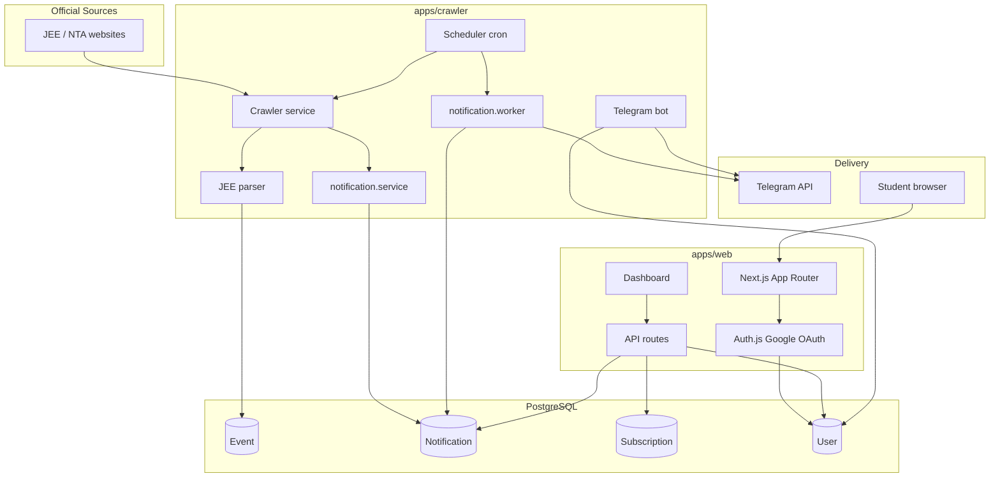

# Architecture

Aviso is a monorepo with two runtime applications sharing a PostgreSQL database via Prisma.

## High-level diagram

## Responsibilities

### Website (`apps/web`)

| Concern | Implementation |
|---------|----------------|
| Auth | Auth.js v5, Google OAuth, JWT sessions |
| User sync | `findOrCreateUser()` on sign-in (jwt callback) |
| Subscriptions | CRUD via `/api/subscriptions` |
| Telegram linking | `/api/me/telegram-link` + bot `/start CODE` deep links |
| Notification history | `/api/me/notifications` + dashboard UI |
| Middleware | Edge-safe `authConfig` — protects `/dashboard/*` |

**Service layer:** `apps/web/src/services/` — Prisma + business logic used by Server Components and API routes.

### Crawler (`apps/crawler`)

| Concern | Implementation |
|---------|----------------|
| Crawling | `crawler.service.ts` — fetch sources, parse, dedupe by fingerprint |
| Parsing | `jee.parser.ts`, `jee-event-classifier.ts` |
| Notification queue | `notification.service.ts` — `createNotificationsForEvent()` |
| Delivery | `notification.worker.ts` — sends Telegram, updates status |
| Scheduling | `scheduler.ts` — cron for crawl + worker |
| Bot | `telegram-bot.service.ts` — commands, deep-link linking |

## Notification pipeline

1. Crawler detects a new `Event` (unique `fingerprint`).
2. `createNotificationsForEvent()` finds active `Subscription` rows where `eventTypes` includes the event type.
3. One `Notification` row per matching subscription (`PENDING`).
4. Worker sends Telegram message to `user.telegramChatId`, sets `DELIVERED` or `FAILED`.
5. Dashboard reads the same `Notification` → `Event` → `Exam` chain for **My Notifications**.

Telegram is the delivery channel. The dashboard is the permanent history.

## Authentication

- **Provider:** Google OAuth
- **Session:** JWT (not database sessions)
- **Middleware:** Uses `authConfig` only (no Prisma on Edge)
- **DB user ID:** Set in `jwt` callback via `findOrCreateUser()` on first sign-in

Required env: `AUTH_SECRET`, `AUTH_GOOGLE_ID`, `AUTH_GOOGLE_SECRET`, `AUTH_URL`.

## Telegram account linking

1. Authenticated user clicks **Connect Telegram** on dashboard.
2. Web generates a 6-character `linkCode` (10-minute TTL) on `User`.
3. Deep link opens `https://t.me/{bot}?start={code}`.
4. Bot calls `linkTelegramAccountWithCode()` — attaches `telegramChatId` to the Google user, clears code.

## API routes (web)

| Route | Method | Auth | Purpose |
|-------|--------|------|---------|
| `/api/auth/*` | * | — | Auth.js handlers |
| `/api/exams` | GET | — | List active exams |
| `/api/events` | GET | — | List events (unfiltered) |
| `/api/subscriptions` | GET, POST | Yes | User subscriptions |
| `/api/subscriptions/[id]` | DELETE | Yes | Cancel subscription |
| `/api/me` | GET | Yes | Current user profile |
| `/api/me/telegram-link` | POST | Yes | Generate link code + deep link |
| `/api/me/notifications` | GET | Yes | Paginated notification history |

## Tech stack

| Layer | Technology |
|-------|------------|
| Web | Next.js 15, React 19, Tailwind v4, Framer Motion, Auth.js |
| Crawler | Node.js, tsx, cheerio, node-cron |
| Database | PostgreSQL 16, Prisma 6 |
| Monorepo | npm workspaces, Turbo |
| Bot | Telegram Bot API (long polling) |

## What not to duplicate

- **Landing exam data** — static in `landing-data.ts` (marketing)
- **Dashboard exams** — from database via `getActiveExams()`
- **Event type labels** — `apps/web/src/lib/event-types.ts` (web); crawler has its own formatter headings

Future: extract shared types/utils into `packages/` when drift becomes a problem.
