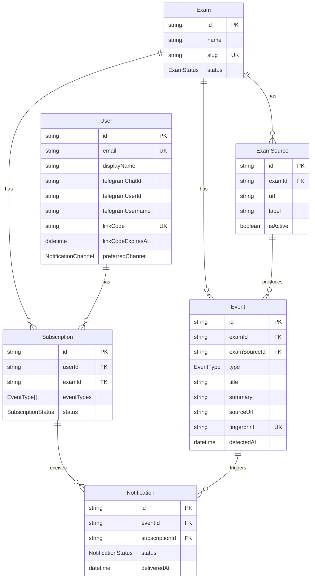

# Entity Relationship Diagram

Visual reference for the Aviso database schema. Source of truth: [`prisma/schema.prisma`](../prisma/schema.prisma).

## ER diagram



## Relationship summary

| From | To | Cardinality | Notes |
|------|-----|-------------|-------|
| Exam | ExamSource | 1:N | Multiple official URLs per exam |
| Exam | Event | 1:N | All detected updates |
| Exam | Subscription | 1:N | Students tracking this exam |
| ExamSource | Event | 1:N | Which source produced the event |
| User | Subscription | 1:N | One per exam (unique pair) |
| Subscription | Notification | 1:N | One notification per event per subscription |
| Event | Notification | 1:N | Same event notifies many subscribers |

## Key constraints

- **Event.fingerprint** — global dedupe; same announcement never stored twice
- **Subscription (userId, examId)** — one subscription row per user per exam
- **Notification (eventId, subscriptionId)** — one delivery record per event per subscription
- **User.linkCode** — unique when set; cleared after Telegram link

## Data flow

```
ExamSource → (crawl) → Event → (match subscriptions) → Notification → (worker) → Telegram
                                                              ↓
                                                         (dashboard reads same rows)
```
